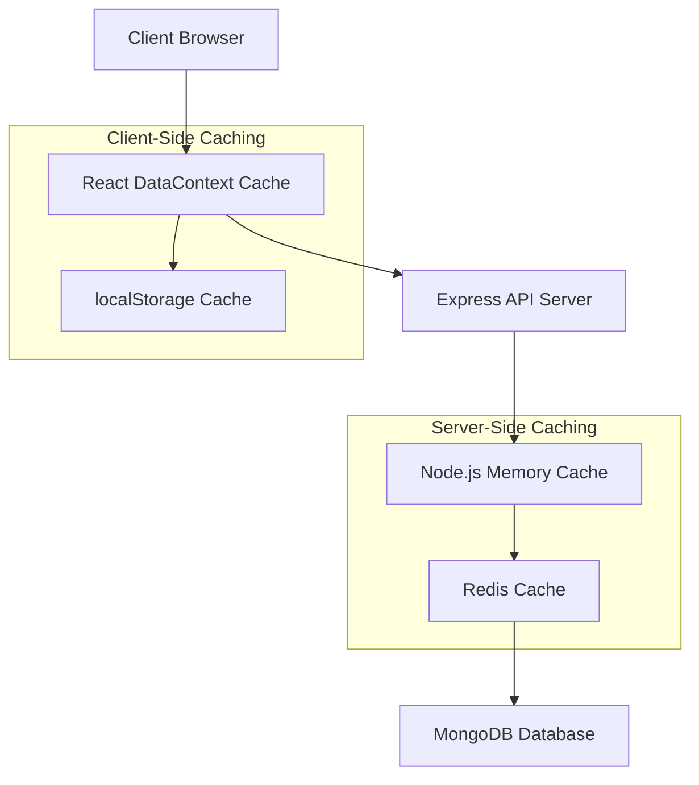

# Design Document

## Overview

This design enhances the existing client-side caching system in the Living Hope Charitable Trust website by implementing a comprehensive multi-layer caching strategy. The system will add server-side memory caching using Redis and Node.js in-memory storage, while optimizing the existing client-side DataContext caching mechanism.

The current system already has:
- Client-side caching with localStorage persistence (5-minute TTL)
- DataContext with cache invalidation hooks
- Automatic cache refresh mechanisms

This design will add:
- Server-side Redis caching for database query results
- In-memory Node.js caching for frequently accessed data
- Enhanced cache invalidation strategies
- Performance monitoring and metrics
- Configurable cache policies

## Architecture

### Multi-Layer Caching Strategy



### Cache Hierarchy

1. **Level 1: Client DataContext Cache** (Existing - Enhanced)
   - In-memory React context cache
   - 5-minute TTL with localStorage persistence
   - Immediate response for cached data

2. **Level 2: Server Node.js Memory Cache** (New)
   - In-process memory cache using node-cache
   - 10-minute TTL for frequently accessed data
   - Reduces Redis queries for hot data

3. **Level 3: Redis Cache** (New)
   - Distributed cache for scalability
   - 30-minute TTL for database query results
   - Supports complex data structures and pub/sub

4. **Level 4: MongoDB Database** (Existing)
   - Primary data source
   - Only queried when all cache levels miss

## Components and Interfaces

### Server-Side Components

#### 1. Cache Manager Service
```typescript
interface CacheManager {
  get<T>(key: string): Promise<T | null>;
  set<T>(key: string, value: T, ttl?: number): Promise<void>;
  delete(key: string): Promise<void>;
  invalidatePattern(pattern: string): Promise<void>;
  getStats(): CacheStats;
}
```

#### 2. Cache Middleware
```typescript
interface CacheMiddleware {
  cacheResponse(options: CacheOptions): ExpressMiddleware;
  invalidateOnUpdate(patterns: string[]): ExpressMiddleware;
}
```

#### 3. Cache Configuration
```typescript
interface CacheConfig {
  redis: {
    host: string;
    port: number;
    ttl: number;
  };
  nodeCache: {
    stdTTL: number;
    checkperiod: number;
    maxKeys: number;
  };
  strategies: {
    [key: string]: CacheStrategy;
  };
}
```

### Client-Side Enhancements

#### 1. Enhanced DataContext
- Add cache warming strategies
- Implement background refresh
- Add cache size management
- Improve error handling and fallbacks

#### 2. Cache Performance Monitor
```typescript
interface CacheMetrics {
  hitRate: number;
  missRate: number;
  averageResponseTime: number;
  cacheSize: number;
}
```

## Data Models

### Cache Entry Structure
```typescript
interface CacheEntry<T> {
  data: T;
  timestamp: number;
  ttl: number;
  version: string;
  tags: string[];
}
```

### Cache Key Strategy
```
Pattern: {service}:{operation}:{params}:{version}
Examples:
- projects:all:v1
- projects:category:education:v1
- gallery:all:v1
- gallery:category:events:v1
- donations:stats:v1
```

### Cache Tags for Invalidation
```typescript
const CACHE_TAGS = {
  PROJECTS: 'projects',
  GALLERY: 'gallery',
  CATEGORIES: 'categories',
  DONATIONS: 'donations',
  VOLUNTEERS: 'volunteers'
};
```

## Error Handling

### Cache Failure Strategies

1. **Graceful Degradation**
   - If Redis fails, fall back to Node.js memory cache
   - If all server caches fail, query database directly
   - Client cache continues to work independently

2. **Circuit Breaker Pattern**
   - Temporarily disable caching if error rate exceeds threshold
   - Automatic recovery after cooldown period

3. **Cache Warming**
   - Pre-populate cache with essential data on server startup
   - Background refresh of expiring cache entries

### Error Recovery
```typescript
interface CacheErrorHandler {
  handleCacheMiss(key: string, fallback: () => Promise<any>): Promise<any>;
  handleCacheError(error: Error, operation: string): void;
  shouldBypassCache(error: Error): boolean;
}
```

## Testing Strategy

### Unit Tests
- Cache manager operations (get, set, delete, invalidate)
- Cache middleware functionality
- Client-side cache context methods
- Error handling scenarios

### Integration Tests
- End-to-end cache flow (client → server → database)
- Cache invalidation across all layers
- Performance under load
- Failover scenarios

### Performance Tests
- Cache hit/miss ratios
- Response time improvements
- Memory usage optimization
- Concurrent access handling

### Cache-Specific Test Scenarios
1. **Cache Hit Scenarios**
   - Verify data served from each cache layer
   - Measure response time improvements

2. **Cache Miss Scenarios**
   - Ensure proper fallback to database
   - Verify cache population after miss

3. **Cache Invalidation**
   - Test automatic invalidation on data updates
   - Verify pattern-based invalidation

4. **Cache Expiration**
   - Test TTL behavior across all layers
   - Verify background refresh mechanisms

### Monitoring and Metrics
- Cache hit/miss ratios per endpoint
- Average response times with/without cache
- Memory usage tracking
- Error rates and recovery times

## Implementation Phases

### Phase 1: Server-Side Foundation
- Set up Redis infrastructure
- Implement basic cache manager
- Add cache middleware to existing routes

### Phase 2: Enhanced Client-Side Caching
- Optimize existing DataContext
- Add background refresh capabilities
- Implement cache size management

### Phase 3: Advanced Features
- Add cache warming strategies
- Implement performance monitoring
- Add admin cache management endpoints

### Phase 4: Optimization
- Fine-tune TTL values based on usage patterns
- Implement intelligent cache preloading
- Add cache analytics dashboard